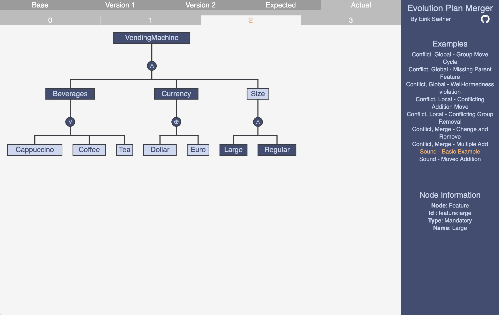
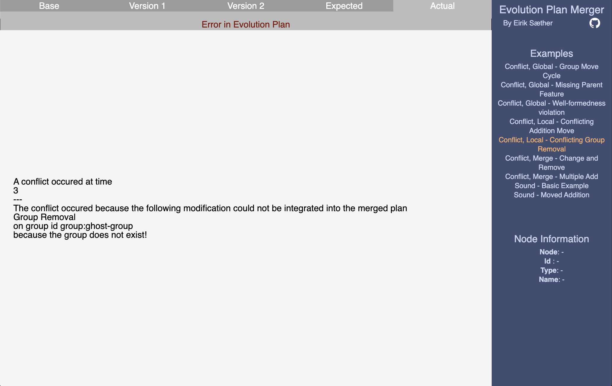

# Master Thesis Frontend

## Introduction

The frontend for the evolution plan three way merge. The frontend is implemented in the strongly typed, purely functional programming language Elm.

The frontend is intended to be used when an example is generated using the CLI from the haskell backend. The backend will write to a file in the frontend, which will let elm parse and display the different evolution plan examples.

The frontend will give you a list of examples, and each example consists of a _base_ and two derived evolution plans, as well as both the expected and actual result of the merge algorithm. Each of the evolution plans will be shown as a list of time points, with each time point yields a tree representation of a feature model.

## Usage

- `elm-live src/Main.elm` Runs the frontend, with compile on save
- `elm-live src/Main.elm -- --debug` Same as above, except with elm debugger tools

## Examples

### Sound Example

### Conflict Example

